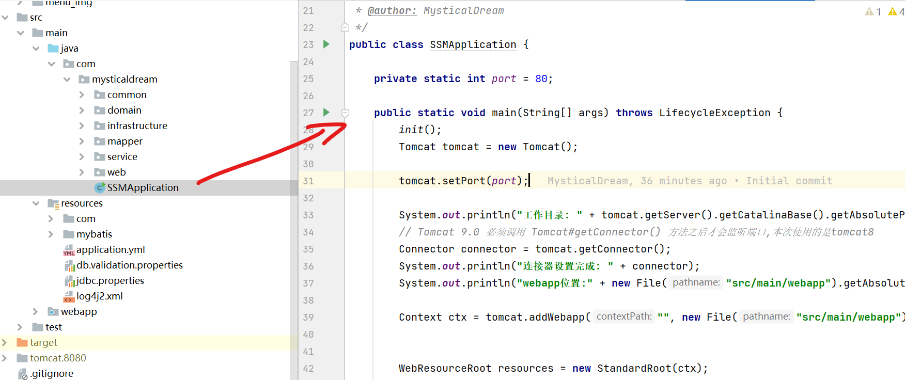
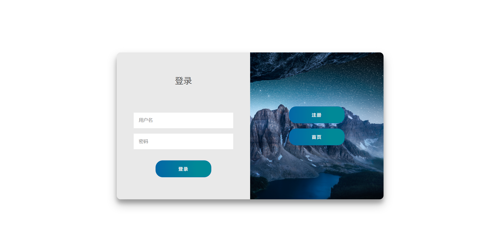
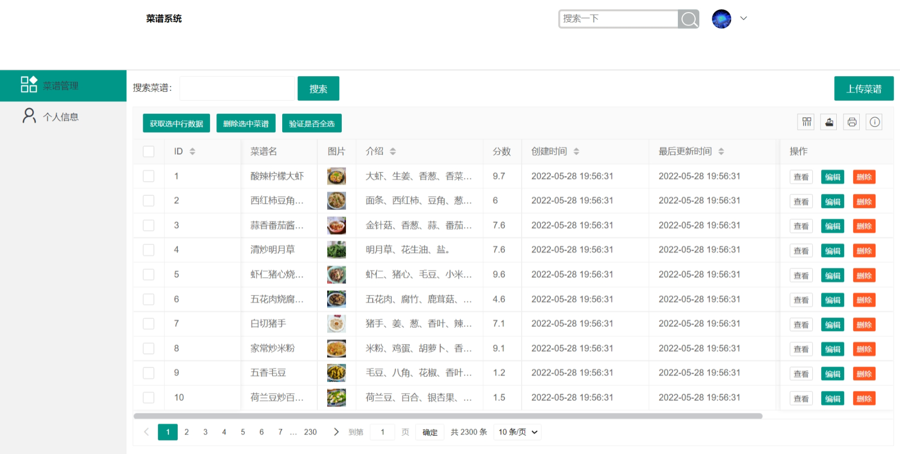
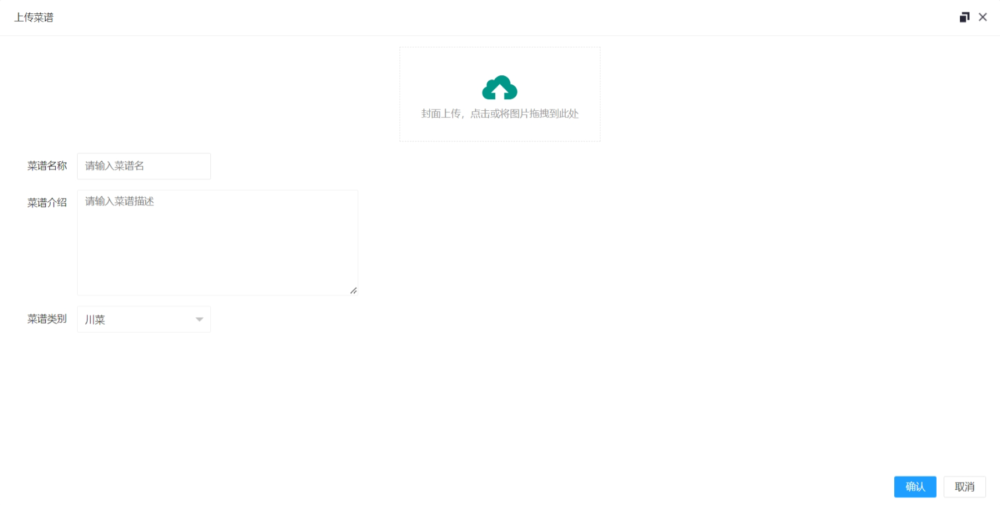

# ssm_menusystem
基于SSM的菜谱管理系统


[](https://github.com/MysticalDream/ssm_menusystem)


# 准备工作

- 修改项目的数据库配置文件`src/main/resources/jdbc.properties`
```properties
#配置连接url,需要指定数据库xxxx
jdbc.url=jdbc:mysql://localhost:3306/xxxx?characterEncoding=UTF-8&serverTimezone=GMT%2B8
#用于连接数据库的用户名
jdbc.username=xxxx
#数据库密码
jdbc.password=xxxx
```
- 修改项目的配置文件`src/main/resources/application.yml`
```yaml
#配置服务器和静态资源路径
ssmServer:
  #配置服务器的端口
  port: 8080 
  #配置静态资源路径，即您需要将项目提供的`menu_system_resources`文件下的两个文件`avatar和menu_img`放到`imgLocation`所配置的路径
  imgLocation: C:/menu_system_resources 
#配置日志打印根路径
log4j:
  #如需更改日志打印路径，您可以通过修改该配置选项来实现
  basePath: D:/mylogs 

```

# 运行项目
配置完成后直接运行`src/main/java/com/mysticaldream/SSMApplication.java`文件


# 运行截图











